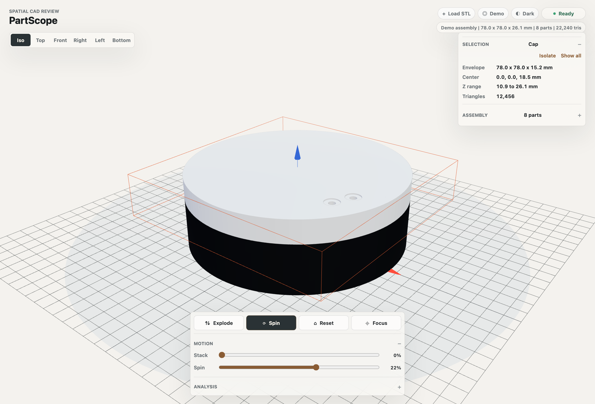
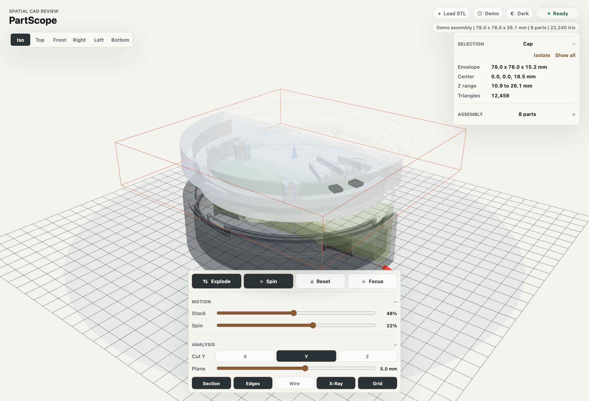

# PartScope

PartScope is a small Three.js viewer for reviewing STL assemblies in the browser.
It is built for the tight loop: open the model, inspect the stack, cut a section, isolate a part, move on.



## Why It Exists

Most CAD review tools are either too heavy, too closed, or too tied to a larger system.
PartScope keeps the job narrow:

- inspect a mechanical assembly quickly
- compare parts in context
- check sections, edges, and exploded views
- keep the asset flow local and simple

## Features

- View presets for fast orientation
- Exploded view and adjustable spin
- Section cuts on X, Y, and Z
- Edge, wireframe, x-ray, and grid overlays
- Part selection, focus, and isolation
- Bundled demo assembly
- Local STL upload from file picker or drag and drop



## Quick Start

```bash
npm install
npm run dev
```

That starts the viewer with the bundled demo assembly in `public/models/concept_puck_v3`.
Use `Load STL` or drag `.stl` files onto the window to inspect local geometry without uploading it anywhere.

## Model Contract

The bundled demo assembly is loaded from:

- `concept_puck_v3_base.stl`
- `concept_puck_v3_battery_18650.stl`
- `concept_puck_v3_main_board.stl`
- `concept_puck_v3_mezz_connectors.stl`
- `concept_puck_v3_mic_capsules.stl`
- `concept_puck_v3_sensor_board.stl`
- `concept_puck_v3_top.stl`
- `concept_puck_v3_vibration_sensor.stl`

## Build

```bash
npm run build
```

## Notes

- The viewer stays separate from hardware generation scripts so the review surface can evolve independently.
- Local uploads are parsed in the browser and are not sent to a server.
